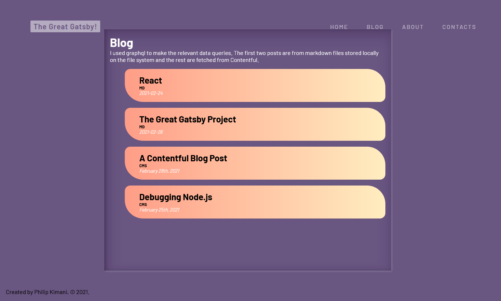
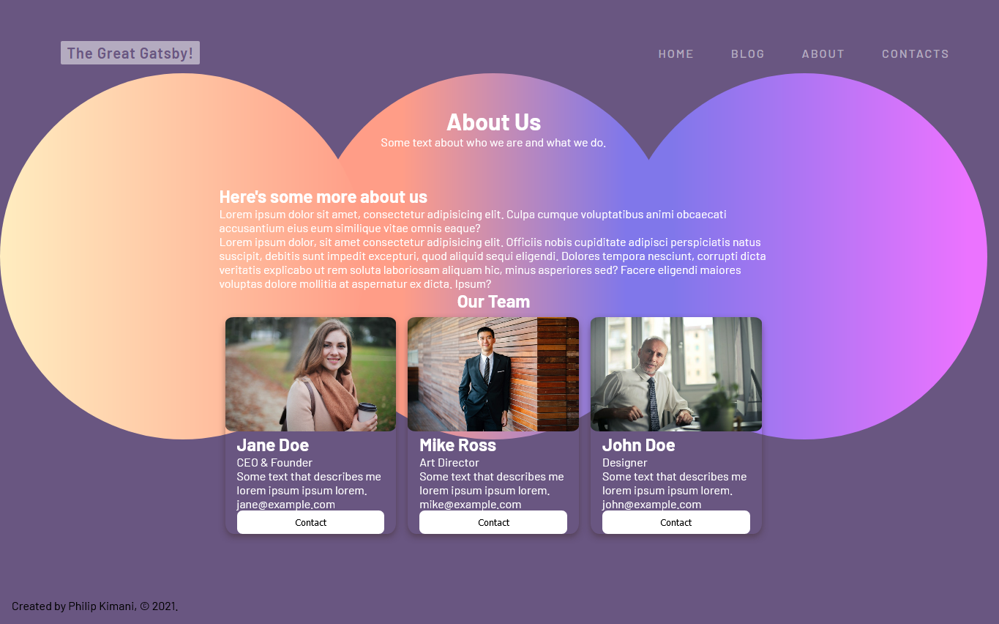
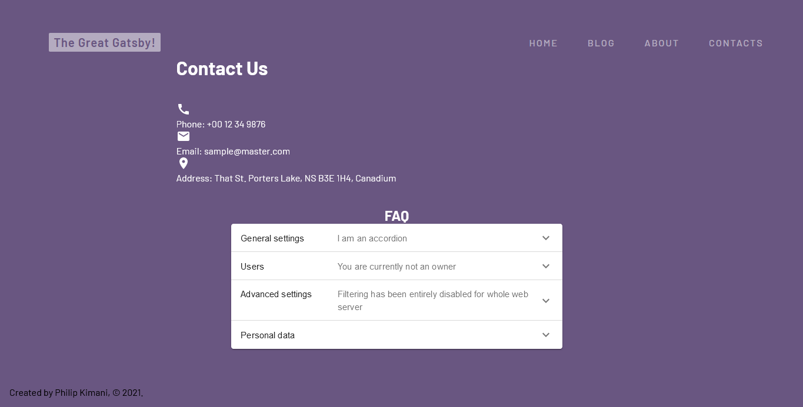

<!-- AUTO-GENERATED-CONTENT:START (STARTER) -->
<p align="center">
  <a href="https://www.gatsbyjs.com">
    
  </a>
</p>
<h1 align="center">
  Gatsby blog project 
</h1>

This project used the hello-world boilerplate starter which shipped with the main Gatsby configuration needed to get up and running with the blazing fast app generator for React.

Home                                      | Blogs
:----------------------------------------:|:--------------------------------------:
 | 
About                                     | Contact
 | 

The project uses Gatsby's GraphQL API to dynamically query data into the site. It also makes use of Contentful for setting up post data.

## 🚀 Quick start

1.  **Create the Gatsby site.**

    Use the Gitash to clone the project.

    ```shell
    # create a new Gatsby site using the hello-world starter
    git clone https://github.com/der-Ubermensch/gatsby-project-blogs.git
    ```

1.  **Start developing.**

    Navigate into the new site’s directory and start it up.

    ```shell
    cd gatsby-project/
    gatsby run develop
    ```

1.  **Open the source code and start editing!**

    Your site is now running at `http://localhost:8000`!

    _Note: You'll also see a second link: _`http://localhost:8000/___graphql`_. This is a tool you can use to experiment with querying your data. Learn more about using this tool in the [Gatsby tutorial](https://www.gatsbyjs.com/tutorial/part-five/#introducing-graphiql)._

    Open the `gatsby-project` directory in your code editor of choice and edit `src/pages/index.js`. Save your changes and the browser will update in real time!

## 🧐 What's inside?

Here is a list of the dependencies you'll see in this Gatsby project.


        gatsby-starter-hello-world@0.1.0 C:\..\gatsby-project
    ├── @contentful/rich-text-react-renderer@14.1.2
    ├── @material-ui/core@4.11.3
    ├── @material-ui/icons@4.11.2
    ├── env-cmd@10.1.0
    ├── gatsby-plugin-react-helmet@4.0.0
    ├── gatsby-plugin-sass@3.2.0
    ├── gatsby-plugin-sharp@2.14.3
    ├── gatsby-remark-images@3.11.1
    ├── gatsby-remark-relative-images@2.0.2
    ├── gatsby-source-contentful@4.5.0
    ├── gatsby-source-filesystem@2.11.1
    ├── gatsby-transformer-remark@2.16.1
    ├── gatsby@2.32.8
    ├── prettier@2.2.1
    ├── react-dom@16.13.1
    ├── react-helmet@6.1.0
    ├── react@16.13.1
    └── sass@1.32.8


  **`LICENSE`**: This Gatsby starter is licensed under the 0BSD license.


## 🎓 Learn More

Full documentation for Gatsby lives [on the website](https://www.gatsbyjs.com/). Here you will find more information about the dependencies and their configuration.


## 💫 Deploy

[](https://app.netlify.com/start/deploy?repository=https://github.com/gatsbyjs/gatsby-starter-hello-world)

[](https://vercel.com/import/project?template=https://github.com/gatsbyjs/gatsby-starter-hello-world)

<!-- AUTO-GENERATED-CONTENT:END -->
