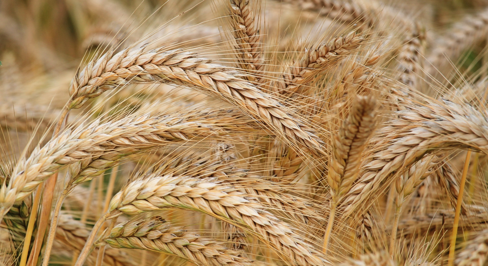

---
# front matter
title: "The Great Gatsby Project"
date: "2021-02-26"
---
<!-- blogpost content -->
I just launched a new project!

## Topics Covered

1. Gatsby
2. GraphQL
3. React

This is a sample post all about the beauty of using Gatsby for your websites.

Go from idea to production in literal minutes with a 10x developer experience. Gatsby is built on popular, proven tech like React and GraphQL, has loads of tutorials and starter templates, and over 2500 plugins that can help integrate all of your favorite web services.
